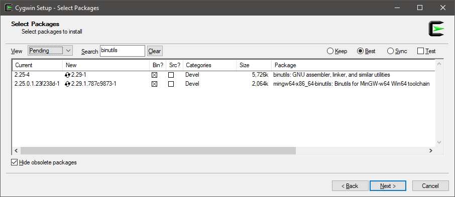

# Disassembler

Can be enabled by using `[DisassemblyDiagnoser]` or command line args: `-d` or `--disasm`.

The configuration options available from code level are:

* `maxDepth`: Includes called methods to given level. 1 by default, indexed from 1. To print just the benchmark set it to 0. This option is also available from the console arguments level `--disasmDepth`.
* `printSource`: C#|F#|VB source code will be printed. False by default.
* `printInstructionAddresses`: Print instruction addresses. False by default.
* `exportGithubMarkdown`: Exports to GitHub markdown. True by default.
* `exportHtml`: Exports to HTML with clickable links. False by default.
* `exportCombinedDisassemblyReport`: Exports all benchmarks to a single HTML report. Makes it easy to compare different runtimes or methods (each becomes a column in HTML table).
* `exportDiff`: Exports a diff of the assembly code to the Github markdown format. False by default.

### Requirements

Disassembly Diagnoser requires following settings in your `.csproj` file:

```xml
<PropertyGroup>
  <PlatformTarget>AnyCPU</PlatformTarget>
  <DebugType>pdbonly</DebugType>
  <DebugSymbols>true</DebugSymbols>
</PropertyGroup>
```

To get the source code we need to locate and read the `.pdb` files.
This is why we need `DebugType` and `DebugSymbols` settings.
To compare different platforms the project which defines benchmarks has to target `AnyCPU`.

### Disassembly Diagnoser for Mono on Windows

If you want to get a disassembly listing for Mono on Windows, you need `as` and `x86_64-w64-mingw32-objdump.exe` tools.
If you don't have it, you will get a warning like follows:

```
It's impossible to get Mono disasm because you don't have some required tools:
'as' is not recognized as an internal or external command
'x86_64-w64-mingw32-objdump.exe' is not recognized as an internal or external command
```

The easiest way to get these tools:

1. Download and install [Cygwin](https://www.cygwin.com/)
2. On the "Select Packages" screen, search for `binutils`
3. Install `binutils` and `mingw64-x86_64-binutils`
4. Add `cygwin64\bin\` (or `cygwin\bin\`) in `%PATH%`



---

[!include[IntroDisassembly](../samples/IntroDisassembly.md)]

[!include[IntroDisassemblyRyuJit](../samples/IntroDisassemblyRyuJit.md)]

[!include[IntroDisassemblyAllJits](../samples/IntroDisassemblyAllJits.md)]

[!include[IntroDisassemblyDry](../samples/IntroDisassemblyDry.md)]