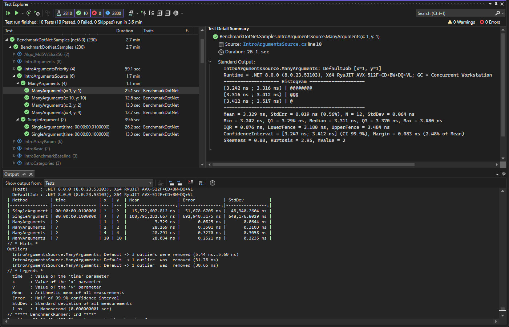

# Running benchmarks as tests

`BenchmarkDotNet.TestAdapter` lets your IDE and `dotnet test` discover and execute your benchmarks the way they do
  unit tests.
This provides an alternative user experience to running benchmarks with the CLI
  and may be preferable for those who like their IDE's test integrations that they may have used when running unit tests.

Below is an example of running some benchmarks from the BenchmarkDotNet samples project in Visual Studio's Test Explorer.



The adapter supports two test platforms:

* [Microsoft.Testing.Platform](https://learn.microsoft.com/dotnet/core/testing/microsoft-testing-platform-intro) (MTP),
  the platform that `dotnet test` and modern IDE integrations are moving to. **This is the default.**
* [VSTest](xref:docs.vstest), for tooling without Microsoft.Testing.Platform support (such as Visual Studio 2019)
  and for solutions that mix benchmark projects with VSTest based test projects.

The difference that matters most is *where your benchmarks run*:

* With **VSTest**, an external `testhost` process loads your benchmark assembly and the adapter reflects into it.
* With **Microsoft.Testing.Platform**, your benchmark project *is* the test host.
  There is no separate host process, so BenchmarkDotNet behaves exactly as it does when you run the app from the CLI,
  and the adapter does not need the child `AppDomain` that the VSTest adapter uses to load your assemblies correctly.

## Caveats and things to know

* **The benchmark measurements may be affected by the test host and your IDE!**
  If you want accurate measurements,
    it is still recommended to run benchmarks through the CLI without other processes impacting performance.
  The measurements remain useful during development when comparing different approaches.
* **The adapter will not display or execute benchmarks if optimizations are disabled.**
  Please ensure you are compiling in Release mode or with `Optimize` set to true.
  Using an `InProcess` toolchain will let you run your benchmarks with optimizations disabled
    and will let you attach the debugger as well.
* **The adapter will not call your application's entry point.**
  If you use the entry point to customize how your benchmarks are run,
    you will need to do this through other means such as an assembly-level `IConfigSource`,
    as shown in [Setting a default configuration](xref:docs.vstest#setting-a-default-configuration).
* **The adapter will generate an entry point for you automatically.**
  The generated entry point starts the test application.
  See [Keeping your own entry point](#keeping-your-own-entry-point) if your project already has one.

## Getting started

* **Step 1.** Install the NuGet package.
  Only one package is needed; it brings in `Microsoft.Testing.Platform` and the MSBuild integration for you:

```xml
<ItemGroup>
  <PackageReference Include="BenchmarkDotNet.TestAdapter" Version="0.16.0" />
</ItemGroup>
```

* **Step 2.** Make sure the project is an executable and does not define its own entry point.
  Microsoft.Testing.Platform applications are executables, and the package generates the entry point for you.
  Here is a complete `.csproj` based on the default Console Application template:

```xml
<Project Sdk="Microsoft.NET.Sdk">

  <PropertyGroup>
    <OutputType>Exe</OutputType>
    <TargetFramework>net10.0</TargetFramework>
    <ImplicitUsings>enable</ImplicitUsings>
    <Nullable>enable</Nullable>
  </PropertyGroup>

  <ItemGroup>
    <PackageReference Include="BenchmarkDotNet.TestAdapter" Version="0.16.0" />
  </ItemGroup>

</Project>
```

> [!NOTE]
> The name of your project file must match the name of the produced assembly.
> This is a general BenchmarkDotNet requirement: it rebuilds your project to run benchmarks out of process.

* **Step 3.** Opt into the Microsoft.Testing.Platform mode of `dotnet test`.
  On the .NET 10 SDK and later this is required, because `dotnet test` runs in VSTest mode by default.
  Add a `global.json` next to your solution:

```json
{
  "test": {
    "runner": "Microsoft.Testing.Platform"
  }
}
```

  On the .NET 9 SDK and earlier this step is not needed:
    the package sets `TestingPlatformDotnetTestSupport` for you, which routes `dotnet test` to the platform.

* **Step 4.** Switch to the `Release` configuration.
  As mentioned above, the adapter does not discover or run benchmarks with optimizations disabled (by design).

* **Step 5.** Build and run.

```console
dotnet test -c Release
```

  You can also run the produced executable directly, which is the same thing without going through MSBuild:

```console
dotnet run -c Release
```

If this doesn't work for you, don't hesitate to file [a new GitHub issue](https://github.com/dotnet/BenchmarkDotNet/issues/new).

## Listing and filtering benchmarks

The benchmark project is a normal Microsoft.Testing.Platform application, so it accepts the platform's options.
Run it with `--help` to see all of them; the ones you are most likely to want are:

```console
# List the benchmarks without running them.
dotnet run -c Release -- --list-tests

# Run every benchmark of a class.
dotnet run -c Release -- --treenode-filter "/*/*/MyBenchmarks/*"

# Run every benchmark of a category.
dotnet run -c Release -- --treenode-filter "/*/*/*/*[Category=Fast]"
```

The tree node filter path is `/<assembly>/<namespace>/<class>/<benchmark>`,
  and `[BenchmarkCategory]` attributes are exposed as a `Category` trait that the filter can match on.

## Keeping your own entry point

The generated entry point starts the test application, which means it replaces the `BenchmarkSwitcher` entry point that
  a benchmark project normally has.
There are two ways to keep your own.

To keep a plain `BenchmarkSwitcher` entry point, tell the adapter that the project generates its own:

```xml
<PropertyGroup>
  <!-- This project has its own entry point. -->
  <GenerateProgramFile>false</GenerateProgramFile>
</PropertyGroup>
```

The project is then a normal console application again, and no test platform integration is set up for it.

To keep an entry point *and* the test integration, start the test application yourself:

```xml
<PropertyGroup>
  <IsTestingPlatformApplication>true</IsTestingPlatformApplication>
  <GenerateTestingPlatformEntryPoint>false</GenerateTestingPlatformEntryPoint>
</PropertyGroup>
```

```csharp
using BenchmarkDotNet.TestAdapter.TestingPlatform;
using Microsoft.Testing.Platform.Builder;

public static class Program
{
    public static async Task<int> Main(string[] args)
    {
        var builder = await TestApplication.CreateBuilderAsync(args);
        builder.AddBenchmarkDotNet();
        using var app = await builder.BuildAsync();
        return await app.RunAsync();
    }
}
```

From there you are free to decide when to start the test application and when to hand over to `BenchmarkSwitcher`,
  for example by looking at the arguments your CI passes.

## Using VSTest instead

Set `BenchmarkDotNetUseVSTest` and add the VSTest host package:

```xml
<PropertyGroup>
  <BenchmarkDotNetUseVSTest>true</BenchmarkDotNetUseVSTest>
</PropertyGroup>

<ItemGroup>
  <PackageReference Include="BenchmarkDotNet.TestAdapter" Version="0.16.0" />
  <PackageReference Include="Microsoft.NET.Test.Sdk" Version="18.0.1" />
</ItemGroup>
```

See [Running with VSTest](xref:docs.vstest) for the details, including the IDE settings that VSTest integration needs.

## Viewing the results

The full BenchmarkDotNet output, including the summary table that compares benchmarks with each other,
  is written to the test run output.

In addition, each individual benchmark reports its own output, containing a histogram and various statistics for that
  single benchmark case.
Depending on your IDE, this is shown when selecting the test after running it.
