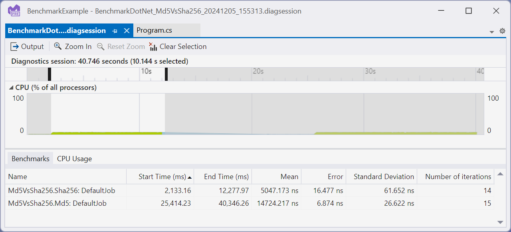

# Running with Visual Studio profiler
Visual Studio supports [profiler integration with BenchmarkDotNet](https://learn.microsoft.com/visualstudio/profiling/profiling-with-benchmark-dotnet) on Windows through its [Microsoft.VisualStudio.BenchmarkDotNetDiagnosers](https://www.nuget.org/packages/Microsoft.VisualStudio.DiagnosticsHub.BenchmarkDotNetDiagnosers) NuGet package. Once installed, Visual Studio specific diagnosers will capture performance data in runs and automatically open traces if launched through Visual Studio



## How it works

First, install the [Microsoft.VisualStudio.BenchmarkDotNetDiagnosers](https://www.nuget.org/packages/Microsoft.VisualStudio.DiagnosticsHub.BenchmarkDotNetDiagnosers) NuGet package in your benchmarking project. Next add one or more of the Visual Studio diagnosers to your benchmark to capture the relevant profiling information while benchmarking. Lastly, run your benchmarks and a diagsession will be generated. If run from Visual Studio the diagsession will automatically be opened.

## Available Diagnosers

* `[CPUUsageDiagnoser]` - Enables the [CPU Usage tool](https://learn.microsoft.com/visualstudio/profiling/cpu-usage).
* `[DatabaseDiagnoser]` - Enables the [Database tool](https://learn.microsoft.com/visualstudio/profiling/analyze-database)
* `[DotNetCountersDiagnoser]` - Enables the [.NET Counters tool](https://learn.microsoft.com/visualstudio/profiling/dotnet-counters-tool)
* `[DotNetObjectAllocDiagnoser]` - Enables the [.NET Object Allocation tool](https://learn.microsoft.com/visualstudio/profiling/dotnet-alloc-tool). When using this tool, you must also specify `[DotNetObjectAllocJobConfiguration]` on the benchmark. If this is missing the run will fail and you will receive an error indicating you need to add it.
* `[EventsDiagnoser]` - Enables the [Events tool](https://learn.microsoft.com/visualstudio/profiling/events-viewer)
* `[FileIODiagnoser]` - Enables the [File IO tool](https://learn.microsoft.com/visualstudio/profiling/use-file-io)

## How to use it?

After installing the [Microsoft.VisualStudio.BenchmarkDotNetDiagnosers](https://www.nuget.org/packages/Microsoft.VisualStudio.DiagnosticsHub.BenchmarkDotNetDiagnosers) NuGet package add the following code as a benchmark:

```cs
using System;
using System.Security.Cryptography;
using BenchmarkDotNet.Attributes;
using BenchmarkDotNet.Running;
using Microsoft.VSDiagnostics;

namespace MyBenchmarks
{
    [CPUUsageDiagnoser]
    public class Md5VsSha256
    {
        private const int N = 10000;
        private readonly byte[] data;

        private readonly SHA256 sha256 = SHA256.Create();
        private readonly MD5 md5 = MD5.Create();

        public Md5VsSha256()
        {
            data = new byte[N];
            new Random(42).NextBytes(data);
        }

        [Benchmark]
        public byte[] Sha256() => sha256.ComputeHash(data);

        [Benchmark]
        public byte[] Md5() => md5.ComputeHash(data);
    }

    public class Program
    {
        public static void Main(string[] args)
        {
            var summary = BenchmarkRunner.Run(typeof(Program).Assembly);
        }
    }
}
```

In this case we have added the `[CpuUsageDiagnoser]` to capture a CPU sampling trace. From here run the benchmark in Visual Studio (Ctrl+F5), and after the benchmark run the resulting diagsession will be displayed. Double clicking on one of the benchmark rows shown under the Benchmarks tab will filter the time selection to the specific benchmark allowing you to better isolate and investigate.

