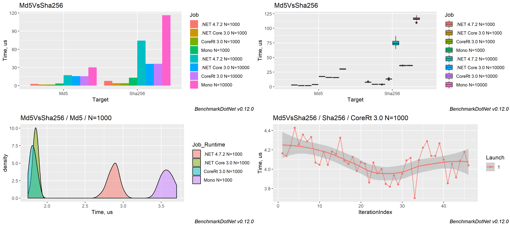

# Overview

## Install

Create new console application and install the [BenchmarkDotNet](https://www.nuget.org/packages/BenchmarkDotNet/) NuGet package. We support:

* *Projects:* classic and modern with PackageReferences
* *Runtimes:* Full .NET Framework (4.6+), .NET Core (2.0+), Mono, NativeAOT
* *OS:* Windows, Linux, MacOS
* *Languages:* C#, F#, VB

## Design a benchmark
Create a new console application, write a class with methods that you want to measure, and mark them with the `Benchmark` attribute. In the following example, we 
compare the [MD5](https://en.wikipedia.org/wiki/MD5) and [SHA256](https://en.wikipedia.org/wiki/SHA-2) cryptographic hash functions:

```cs
using System;
using System.Security.Cryptography;
using BenchmarkDotNet.Attributes;
using BenchmarkDotNet.Running;

namespace MyBenchmarks
{
    public class Md5VsSha256
    {
        private const int N = 10000;
        private readonly byte[] data;

        private readonly SHA256 sha256 = SHA256.Create();
        private readonly MD5 md5 = MD5.Create();

        public Md5VsSha256()
        {
            data = new byte[N];
            new Random(42).NextBytes(data);
        }

        [Benchmark]
        public byte[] Sha256() => sha256.ComputeHash(data);

        [Benchmark]
        public byte[] Md5() => md5.ComputeHash(data);
    }

    public class Program
    {
        public static void Main(string[] args)
        {
            var summary = BenchmarkRunner.Run(typeof(Program).Assembly);
        }
    }
}
```

The `BenchmarkRunner.Run<Md5VsSha256>()` call runs your benchmarks and prints results to the console.

Note that BenchmarkDotNet will only run benchmarks if the application is built in the Release configuration.
This is to prevent unoptimized code from being benchmarked.
BenchmarkDotNet will issue an error if you forget to change the configuration.

## Benchmark results

```
BenchmarkDotNet=v0.13.2, OS=Windows 10 (10.0.19045.2251)
Intel Core i7-4770HQ CPU 2.20GHz (Haswell), 1 CPU, 8 logical and 4 physical cores
.NET SDK=7.0.100
  [Host]     : .NET 7.0.0 (7.0.22.51805), X64 RyuJIT AVX2
  DefaultJob : .NET 7.0.0 (7.0.22.51805), X64 RyuJIT AVX2


| Method |     Mean |    Error |   StdDev |
|------- |---------:|---------:|---------:|
| Sha256 | 51.57 us | 0.311 us | 0.291 us |
|    Md5 | 21.91 us | 0.138 us | 0.129 us |
```

## Jobs

BenchmarkDotNet can benchmark your code in several environments at once. For example, to compare your benchmark's performance in .NET Framework, .NET Core, Mono and NativeAOT, you can add `SimpleJob` attributes to the benchmark class:

```cs
[SimpleJob(RuntimeMoniker.Net481)]
[SimpleJob(RuntimeMoniker.Net70)]
[SimpleJob(RuntimeMoniker.NativeAot70)]
[SimpleJob(RuntimeMoniker.Mono)]
public class Md5VsSha256
```

Example of the result:

```
BenchmarkDotNet=v0.13.2, OS=Windows 10 (10.0.19045.2251)
Intel Core i7-4770HQ CPU 2.20GHz (Haswell), 1 CPU, 8 logical and 4 physical cores
.NET SDK=7.0.100
  [Host]               : .NET 7.0.0 (7.0.22.51805), X64 RyuJIT AVX2
  .NET 7.0             : .NET 7.0.0 (7.0.22.51805), X64 RyuJIT AVX2
  .NET Framework 4.8.1 : .NET Framework 4.8.1 (4.8.9037.0), X64 RyuJIT VectorSize=256
  Mono                 : Mono 6.12.0 (Visual Studio), X64 VectorSize=128
  NativeAOT 7.0        : .NET 7.0.0 (7.0.22.51805), X64 RyuJIT AVX2

| Method |                  Job |              Runtime |      Mean |    Error |   StdDev |
|------- |--------------------- |--------------------- |----------:|---------:|---------:|
| Sha256 |             .NET 7.0 |             .NET 7.0 |  51.90 us | 0.341 us | 0.302 us |
|    Md5 |             .NET 7.0 |             .NET 7.0 |  21.96 us | 0.052 us | 0.049 us |
| Sha256 | .NET Framework 4.8.1 | .NET Framework 4.8.1 | 206.33 us | 2.069 us | 1.834 us |
|    Md5 | .NET Framework 4.8.1 | .NET Framework 4.8.1 |  23.28 us | 0.094 us | 0.083 us |
| Sha256 |                 Mono |                 Mono | 167.70 us | 1.216 us | 1.137 us |
|    Md5 |                 Mono |                 Mono |  42.12 us | 0.145 us | 0.136 us |
| Sha256 |        NativeAOT 7.0 |        NativeAOT 7.0 |  51.45 us | 0.226 us | 0.200 us |
|    Md5 |        NativeAOT 7.0 |        NativeAOT 7.0 |  21.88 us | 0.050 us | 0.041 us |
```

There are many predefined job attributes which you can use. For example, you can compare `LegacyJitX86`, `LegacyJitX64`, and `RyuJitX64`:

```cs
[LegacyJitX86Job, LegacyJitX64Job, RyuJitX64Job]
```

Or, you can define your own jobs:

```cs
[Config(typeof(Config))]
public class Md5VsSha256
{
    private class Config : ManualConfig
    {
        public Config()
        {
            AddJob(new Job(Job.Dry)
            {
                Environment = { Jit = Jit.LegacyJit, Platform = Platform.X64 },
                Run = { LaunchCount = 3, WarmupCount = 5, IterationCount = 10 },
                Accuracy = { MaxRelativeError = 0.01 }
            });
        }
    }
```

Read more: [Jobs](configs/jobs.md), [Configs](configs/configs.md)


## Columns

You can add columns to the summary table:

```cs
[MinColumn, MaxColumn]
public class Md5VsSha256
```

| Method | Median      | StdDev    | Min         | Max         |
| ------ | ----------- | --------- | ----------- | ----------- |
| Sha256 | 131.3200 us | 4.6744 us | 129.8216 us | 147.7630 us |
| Md5    | 26.2847 us  | 0.4424 us | 25.8442 us  | 27.4258 us  |

You can also define custom columns based on the full benchmark summary.

Read more: [Columns](configs/columns.md)

## Exporters

You can export the results of your benchmark in different formats:

```cs
[MarkdownExporter, AsciiDocExporter, HtmlExporter, CsvExporter, RPlotExporter]
public class Md5VsSha256
```

If you have installed R, `RPlotExporter` will generate a lot of nice plots:



Read more: [Exporters](configs/exporters.md)

## Baseline

To view the relative performance of your benchmarks, mark one of your benchmark methods as the `Baseline`:

```cs
public class Sleeps
{
    [Benchmark]
    public void Time50() => Thread.Sleep(50);

    [Benchmark(Baseline = true)]
    public void Time100() => Thread.Sleep(100);

    [Benchmark]
    public void Time150() => Thread.Sleep(150);
}
```

A new column will be added to the summary table:

| Method  | Median      | StdDev    | Ratio |
| ------- | ----------- | --------- | ------ |
| Time100 | 100.2640 ms | 0.1238 ms | 1.00   |
| Time150 | 150.2093 ms | 0.1034 ms | 1.50   |
| Time50  | 50.2509 ms  | 0.1153 ms | 0.50   |

Read more: [Baselines](features/baselines.md)

## Params

You can mark one or several fields or properties in your class with the `Params` attribute. In this attribute, you can specify a set of values. BenchmarkDotNet will run benchmarks for each combination of params values.

```cs
public class IntroParams
{
    [Params(100, 200)]
    public int A { get; set; }

    [Params(10, 20)]
    public int B { get; set; }

    [Benchmark]
    public void Benchmark()
    {
        Thread.Sleep(A + B + 5);
    }
}
```


| Method    | Median      | StdDev    | A    | B    |
| --------- | ----------- | --------- | ---- | ---- |
| Benchmark | 115.3325 ms | 0.0242 ms | 100  | 10   |
| Benchmark | 125.3282 ms | 0.0245 ms | 100  | 20   |
| Benchmark | 215.3024 ms | 0.0375 ms | 200  | 10   |
| Benchmark | 225.2710 ms | 0.0434 ms | 200  | 20   |

Read more: [Parameterization](features/parameterization.md)

## Languages

You can also write benchmarks in `F#` or `VB`.

```fs
type StringKeyComparison () =
    let mutable arr : string [] = [||]
    let dict1 = ConcurrentDictionary<_,_>()
    let dict2 = ConcurrentDictionary<_,_>(StringComparer.Ordinal)

    [<Params (100, 500, 1000, 2000)>] 
    member val public DictSize = 0 with get, set

    [<GlobalSetup>]
    member self.GlobalSetupData() =
        dict1.Clear(); dict2.Clear()
        arr <- getStrings self.DictSize
        arr |> Array.iter (fun x -> dict1.[x] <- true ; dict2.[x] <- true)

    [<Benchmark>]
    member self.StandardLookup () = lookup arr dict1

    [<Benchmark>]
    member self.OrdinalLookup () = lookup arr dict2
```

```vb
Public Class Sample
    <Params(1, 2)>
    Public Property A As Integer
    <Params(3, 4)>
    Public Property B As Integer

    <Benchmark>
    Public Function Benchmark() As Integer
            return A + B
    End Function
End Class
```

## Diagnostics

A diagnoser can attach to your benchmarks and collect additional information.

Examples of diagnosers built in to BenchmarkDotNet are:

- Garbge collection and allocation statistics (`MemoryDiagnoser`).
- Lock contention and thread pool statistics (`ThreadingDiagnoser`), which is only available on .NET Core 3.0+. 
- JIT inlining events (`InliningDiagnoser`). You can find this diagnoser in a separated package with diagnosers for Windows (`BenchmarkDotNet.Diagnostics.Windows`): [](https://www.nuget.org/packages/BenchmarkDotNet.Diagnostics.Windows/)


Below is a sample benchmark using `MemoryDiagnoser`. Note the extra columns on the right-hand side (`Gen 0` and `Allocated`):

```
    Method |       Mean |    StdDev |  Gen 0 | Allocated |
---------- |----------- |---------- |------- |---------- |
 Iterative | 31.0739 ns | 0.1091 ns |      - |       0 B |
      LINQ | 83.0435 ns | 1.0103 ns | 0.0069 |      32 B | 
```

Read more: [Diagnosers](configs/diagnosers.md)

## BenchmarkRunner

There are several ways to run your benchmarks.

```cs
var summary = BenchmarkRunner.Run<MyBenchmarkClass>();
var summary = BenchmarkRunner.Run(typeof(MyBenchmarkClass));
var summaries = BenchmarkSwitcher.FromAssembly(typeof(Program).Assembly).Run(args);
```

Read more: [How to run your benchmarks](guides/how-to-run.md)
