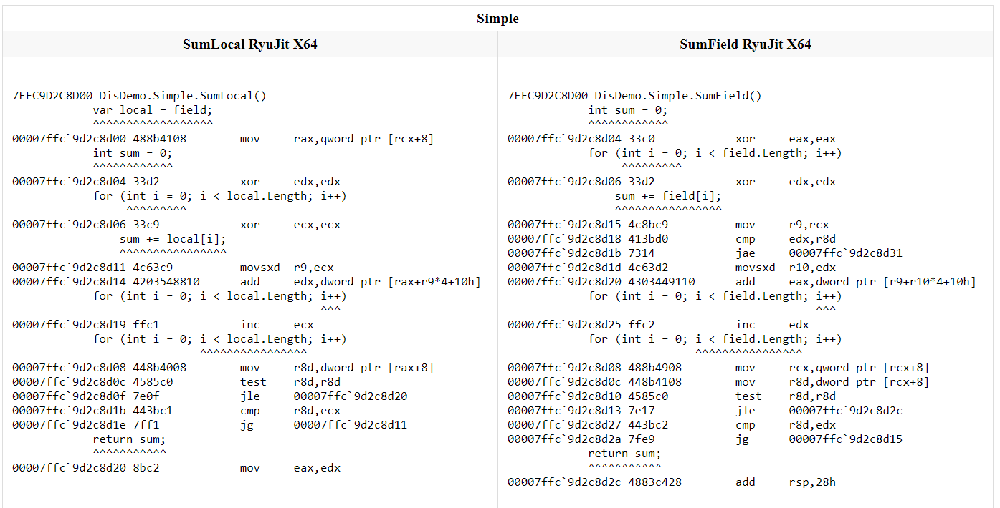

## Sample: IntroDisassemblyRyuJit

### Source code

[!code-csharp[IntroDisassemblyRyuJit.cs](../../../samples/BenchmarkDotNet.Samples/IntroDisassemblyRyuJit.cs)]

### Output

### Links

* @docs.diagnosers
* @docs.disassembler
* The permanent link to this sample: @BenchmarkDotNet.Samples.IntroDisassemblyRyuJit

---