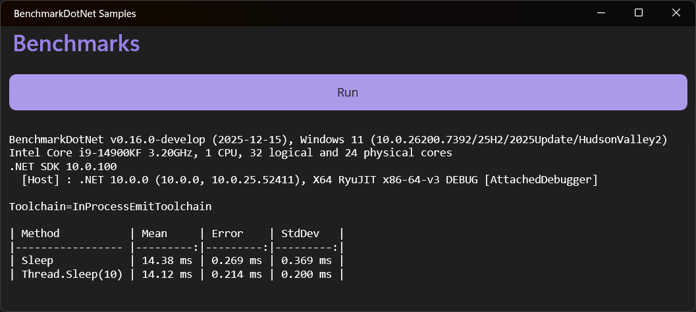
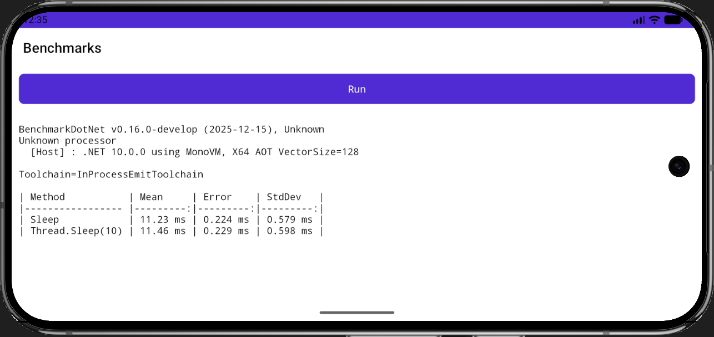
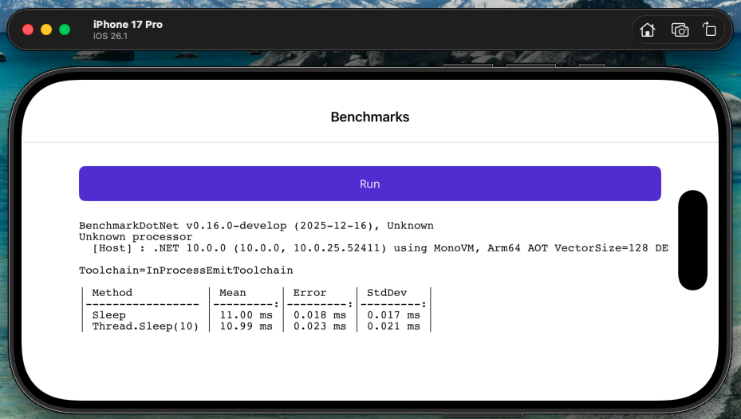
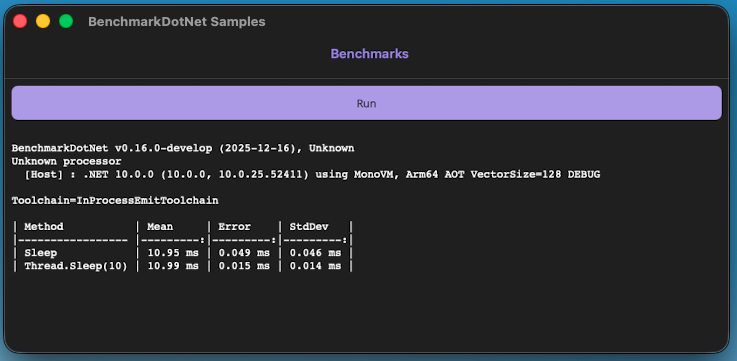

## Sample: IntroMaui

To use BenchmarkDotNet with [.NET MAUI](https://dotnet.microsoft.com/apps/maui), you will need to build a small UI for running benchmarks and displaying the results.

.NET MAUI allows you to run your benchmarks on Android, iOS, Mac Catalyst, and Windows from a single codebase.

Other notes:

* Use `Release` builds when running actual benchmarks.
* Consider disabling trimming appropriately for your benchmarks.

### Source code

[!code-csharp[MainPage.xaml.cs](../../../samples/BenchmarkDotNet.Samples.Maui/MainPage.xaml.cs)]

### Output

#### Windows

#### Android

#### iOS

#### Mac Catalyst

### Links

* [.NET MAUI Documentation](https://learn.microsoft.com/dotnet/maui/)
* [Trimming in .NET MAUI](https://learn.microsoft.com/dotnet/maui/deployment/trimming)
* The permanent link to this sample: @BenchmarkDotNet.Samples.Maui

---
