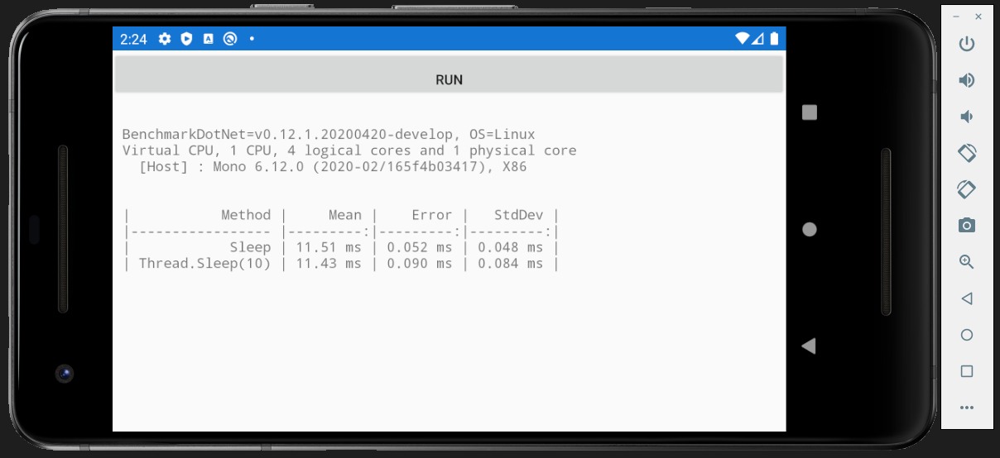

## Sample: IntroXamarin

To use BenchmarkDotNet with Xamarin, you will need to build a small UI for running Benchmarks and displaying the results so you can actually read them.
Using [Xamarin.Forms](https://dotnet.microsoft.com/apps/xamarin/xamarin-forms) is a simple way to be able to run your benchmarks on iOS or Android.

Other notes:

* Use `Release` builds when running actual benchmarks.
* Disable the linker via the `Don't Link` or `None`.

### Source code

[!code-csharp[MainPage.xaml.cs](../../../samples/BenchmarkDotNet.Samples.Forms/MainPage.xaml.cs)]

### Output

### Links

* [Xamarin.Android linker settings](https://learn.microsoft.com/xamarin/android/deploy-test/linker#linker-behavior)
* [Xamarin.iOS linker settings](https://learn.microsoft.com/xamarin/ios/deploy-test/linker#dont-link)
* The permanent link to this sample: @BenchmarkDotNet.Samples.Xamarin

---