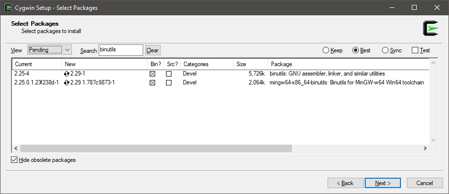

# Diagnosers

A **diagnoser** can attach to your benchmark and get some useful info.

The current Diagnosers are:

- GC and Memory Allocation (`MemoryDiagnoser`) which is cross platform, built-in and **is not enabled by default anymore**. Please see Adam Sitnik's [blog post](http://adamsitnik.com/the-new-Memory-Diagnoser/) for all the details.
- JIT Inlining Events (`InliningDiagnoser`). You can find this diagnoser in a separated package with diagnosers for Windows (`BenchmarkDotNet.Diagnostics.Windows`): [](https://www.nuget.org/packages/BenchmarkDotNet.Diagnostics.Windows/)
- JIT Tail Call Events (`TailCallDiagnoser`). You can find this diagnoser as well as the (`InliningDiagnoser`) in a separated package with diagnosers for Windows (`BenchmarkDotNet.Diagnostics.Windows`): [](https://www.nuget.org/packages/BenchmarkDotNet.Diagnostics.Windows/) Please see [this post](https://georgeplotnikov.github.io/articles/tale-tail-call-dotnet) for all the details.
- Hardware Counter Diagnoser. You can find this diagnoser in a separated package with diagnosers for Windows (`BenchmarkDotNet.Diagnostics.Windows`): [](https://www.nuget.org/packages/BenchmarkDotNet.Diagnostics.Windows/).  Please see Adam Sitnik's [blog post](http://adamsitnik.com/Hardware-Counters-Diagnoser/) for all the details.
- Disassembly Diagnoser. It allows you to disassemble the benchmarked code to asm, IL and C#/F#. Please see Adam Sitnik's [blog post](http://adamsitnik.com/Disassembly-Diagnoser/) for all the details.


## Examples

Below is a sample output from the `GC and Memory Allocation` diagnoser, note the extra columns on the right-hand side ("Gen 0", "Gen 1", "Gen 2" and "Allocated"):

```
           Method |        Mean |     StdErr |      StdDev |      Median |  Gen 0 | Allocated |
----------------- |------------ |----------- |------------ |------------ |------- |---------- |
 'new byte[10kB]' | 884.4896 ns | 46.3528 ns | 245.2762 ns | 776.4237 ns | 0.1183 |     10 kB |
```

A config example:

```cs
private class Config : ManualConfig
{
    public Config()
    {
        Add(MemoryDiagnoser.Default);
        Add(new InliningDiagnoser());
    }
}
```

You can also use one of the following attributes (apply it on a class that contains Benchmarks):
```cs
[MemoryDiagnoser]
[InliningDiagnoser]
[TailCallDiagnoser]
```

In BenchmarkDotNet, 1kB = 1024B, 1MB = 1024kB, and so on.

## Hardware Counters Diagnoser

This diagnoser is not enabled in explicit way as the other diagnosers. You need to specify `[HardwareCounters]` and we choose the right diagnoser in the runtime.

```cs
[HardwareCounters(HardwareCounter.BranchMispredictions, HardwareCounter.BranchInstructions)]
public class Cpu_BranchPredictor
{
    private const int N = 32767;
    private readonly int[] sorted, unsorted;

    public Cpu_BranchPredictor()
    {
        var random = new Random(0);
        unsorted = new int[N];
        sorted = new int[N];
        for (int i = 0; i < N; i++)
            sorted[i] = unsorted[i] = random.Next(256);
        Array.Sort(sorted);
    }

    private static int Branch(int[] data)
    {
        int sum = 0;
        for (int i = 0; i < N; i++)
            if (data[i] >= 128)
                sum += data[i];
        return sum;
    }

    private static int Branchless(int[] data)
    {
        int sum = 0;
        for (int i = 0; i < N; i++)
        {
            int t = (data[i] - 128) >> 31;
            sum += ~t & data[i];
        }
        return sum;
    }

    [Benchmark]
    public int SortedBranch() => Branch(sorted);

    [Benchmark]
    public int UnsortedBranch() => Branch(unsorted);

    [Benchmark]
    public int SortedBranchless() => Branchless(sorted);

    [Benchmark]
    public int UnsortedBranchless() => Branchless(unsorted);
}
```

and the results:

```
 |             Method |        Mean | Mispredict rate | BranchInstructions/Op | BranchMispredictions/Op |
 |------------------- |------------ |---------------- |---------------------- |------------------------ |
 |       SortedBranch |  21.4539 us |           0,04% |                 70121 |                      24 |
 |     UnsortedBranch | 136.1139 us |          23,70% |                 68788 |                   16301 |
 |   SortedBranchless |  28.6705 us |           0,06% |                 35711 |                      22 |
 | UnsortedBranchless |  28.9336 us |           0,05% |                 35578 |                      17 |
```

## Disassembly Diagnoser

You need to use the `DisassemblyDiagnoser` attribute to configure it. The available options are:

* printIL: IL will be printed. False by default.
* printAsm: ASM will be printed. True by default.
* printSource: C# source code will be printed. False by default.
* printPrologAndEpilog: ASM for prolog and epilog will be printed. False by default.
* recursiveDepth: Includes called methods to given level. 1 by default, indexed from 1. To print just benchmark set to 0 

### Requirements

Disassembly Diagnoser requires following settings in your `.csproj` file:

```xml
<PropertyGroup>
  <PlatformTarget>AnyCPU</PlatformTarget>
  <DebugType>pdbonly</DebugType>
  <DebugSymbols>true</DebugSymbols>
</PropertyGroup>
```

To get the source code we need to locate and read the `.pdb` files. This is why we need `DebugType` and `DebugSymbols` settings.
To compare different platforms the project which defines benchmarks has to target `AnyCPU`.

### Sample

```cs
[DisassemblyDiagnoser(printAsm: true, printSource: true)] // !!! use the new diagnoser!!
[RyuJitX64Job]
public class Simple
{
    int[] field = Enumerable.Range(0, 100).ToArray();

    [Benchmark]
    public int SumLocal()
    {
        var local = field; // we use local variable that points to the field

        int sum = 0;
        for (int i = 0; i < local.Length; i++)
            sum += local[i];

        return sum;
    }

    [Benchmark]
    public int SumField()
    {
        int sum = 0;
        for (int i = 0; i < field.Length; i++)
            sum += field[i];

        return sum;
    }
}
```


### Disassembly Diagnoser for Mono on Windows

If you want to get a disassembly listing for Mono on Windows, you need `as` and `x86_64-w64-mingw32-objdump.exe` tools.
If you don't have it, you will get a warning like follows:

```
It's impossible to get Mono disasm because you don't have some required tools:
'as' is not recognized as an internal or external command
'x86_64-w64-mingw32-objdump.exe' is not recognized as an internal or external command
```

The easiest way to get these tools:

1. Download and install [Cygwin](https://www.cygwin.com/)
2. On the "Select Packages" screen, search for `binutils`
3. Install `binutils` and `mingw64-x86_64-binutils`
4. Add `cygwin64\bin\` (or `cygwin\bin\`) in `%PATH%`



### ALL JITs

You can use a single config to compare the generated assembly code for ALL JITs. 

But to allow benchmarking any target platform architecture the project which defines benchmarks has to target **AnyCPU**. 

```xml
<PropertyGroup>
  <PlatformTarget>AnyCPU</PlatformTarget>
</PropertyGroup>
```

```cs
public class MultipleJits : ManualConfig
{
    public MultipleJits()
    {
        Add(Job.ShortRun.With(new MonoRuntime(name: "Mono x86", customPath: @"C:\Program Files (x86)\Mono\bin\mono.exe")).With(Platform.X86));
        Add(Job.ShortRun.With(new MonoRuntime(name: "Mono x64", customPath: @"C:\Program Files\Mono\bin\mono.exe")).With(Platform.X64));

        Add(Job.ShortRun.With(Jit.LegacyJit).With(Platform.X86).With(Runtime.Clr));
        Add(Job.ShortRun.With(Jit.LegacyJit).With(Platform.X64).With(Runtime.Clr));

        Add(Job.ShortRun.With(Jit.RyuJit).With(Platform.X64).With(Runtime.Clr));

        // RyuJit for .NET Core 2.0
        Add(Job.ShortRun.With(Jit.RyuJit).With(Platform.X64).With(Runtime.Core).With(CsProjCoreToolchain.NetCoreApp20));

        // RyuJit for .NET Core 2.1
        Add(Job.ShortRun.With(Jit.RyuJit).With(Platform.X64).With(Runtime.Core).With(CsProjCoreToolchain.NetCoreApp21));

        Add(DisassemblyDiagnoser.Create(new DisassemblyDiagnoserConfig(printAsm: true, printPrologAndEpilog: true, recursiveDepth: 3)));
    }
}

[Config(typeof(MultipleJits))]
public class Jit_Devirtualization
{
    private Increment increment = new Increment();

    [Benchmark]
    public int CallVirtualMethod() => increment.OperateTwice(10);

    public abstract class Operation  // abstract unary integer operation
    {
        public abstract int Operate(int input);

        public int OperateTwice(int input) => Operate(Operate(input)); // two virtual calls to Operate
    }

    public sealed class Increment : Operation // concrete, sealed operation: increment by fixed amount
    {
        public readonly int Amount;
        public Increment(int amount = 1) { Amount = amount; }

        public override int Operate(int input) => input + Amount;
    }
}
```

The disassembly result can be obtained [here](http://adamsitnik.com/files/disasm/Jit_Devirtualization-disassembly-report.html). The file was too big to embed it in this doc page.

### Getting only the Disassembly without running the benchmarks for a long time

Sometimes you might be interested only in the disassembly, not the results of the benchmarks. In that case you can use **Job.Dry** which runs the benchmark only **once**.

```cs
public class JustDisassembly : ManualConfig
{
    public JustDisassembly()
    {
        Add(Job.Dry.With(Jit.RyuJit).With(Platform.X64).With(Runtime.Core).With(CsProjCoreToolchain.NetCoreApp20));
        Add(Job.Dry.With(Jit.RyuJit).With(Platform.X64).With(Runtime.Core).With(CsProjCoreToolchain.NetCoreApp21));

        Add(DisassemblyDiagnoser.Create(new DisassemblyDiagnoserConfig(printAsm: true, printPrologAndEpilog: true, recursiveDepth: 3)));
    }
}
```

## Restrictions

* In order to not affect main results we perform a separate run if any diagnoser is used. That's why it might take more time to execute benchmarks.
* MemoryDiagnoser:
	* Mono currently [does not](http://stackoverflow.com/questions/40234948/how-to-get-the-number-of-allocated-bytes-in-mono) expose any api to get the number of allocated bytes. That's why our Mono users will get `?` in Allocated column.
	* In order to get the number of allocated bytes in cross platform way we are using `GC.GetAllocatedBytesForCurrentThread` which recently got [exposed](https://github.com/dotnet/corefx/pull/12489) for netcoreapp1.1. That's why BenchmarkDotNet does not support netcoreapp1.0 from version 0.10.1.
	* MemoryDiagnoser is `99.5%` accurate about allocated memory when using default settings or Job.ShortRun (or any longer job than it).
* HardwareCounters:
	* Windows 8+ only (we plan to add Unix support in the future)
    * No Hyper-V (Virtualization) support
    * Requires running as Admin (ETW Kernel Session)
    * No `InProcessToolchain` support ([#394](https://github.com/dotnet/BenchmarkDotNet/issues/394))
* Disassembly Diagnoser:
    * .NET Core disassembler works only on Windows
    * Mono disassembler does not support recursive disassembling and produces output without IL and C#.
    * Indirect calls are not tracked.
    * To be able to compare different platforms, you need to target AnyCPU `<PlatformTarget>AnyCPU</PlatformTarget>`
    * To get the corresponding C#/F# code from disassembler you need to configure your project in following way:

```xml
<DebugType>pdbonly</DebugType>
<DebugSymbols>true</DebugSymbols>
```

## Tailcall Diagnoser

You need to use the `TailcallDiagnoser` attribute to configure it. The available options are:

* logFailuresOnly: Track only the methods that failed to get tail called. True by default.
* filterByNamespace : Track only the methods from declaring type's namespace. Set to false if you want to see all Jit tail events. True by default.

### Sample

```cs
[Diagnostics.Windows.Configs.TailCallDiagnoser]
[LegacyJitX86Job, LegacyJitX64Job, RyuJitX64Job]
public class Jit_TailCalling
{
    [Benchmark]
    public long Calc()
        => FactorialWithoutTailing(7) - FactorialWithTailing(7);

    private static long FactorialWithoutTailing(int depth)
        => depth == 0 ? 1 : depth * FactorialWithoutTailing(depth - 1);

    private static long FactorialWithTailing(int pos, int depth)
        => pos == 0 ? depth : FactorialWithTailing(pos - 1, depth * pos);

    private static long FactorialWithTailing(int depth)
        => FactorialWithTailing(1, depth);
}
```

### The result

The benchmark results were omitted for brevity.

```
// * Diagnostic Output - TailCallDiagnoser *
--------------------

--------------------
Jit_TailCalling.Calc: LegacyJitX64(Jit=LegacyJit, Platform=X64, Runtime=Clr)
--------------------

--------------------
Jit_TailCalling.Calc: LegacyJitX86(Jit=LegacyJit, Platform=X86, Runtime=Clr)
--------------------

--------------------
Jit_TailCalling.Calc: RyuJitX64(Jit=RyuJit, Platform=X64)
--------------------
Caller: <null>.<null> - <null>
Callee: BenchmarkDotNet.Samples.JIT.Jit_TailCalling.FactorialWithTailing - int64  (int32,int32)
Tail prefix: False
Tail call type: RecursiveLoop
-------------------
```

### Restrictions

* Windows only
* x64
