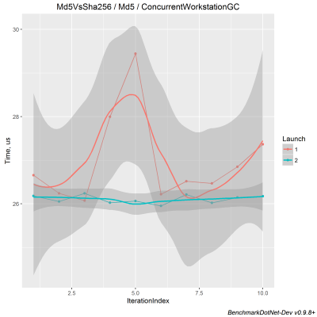

# Overview

## Install

Create new console application and install the [BenchmarkDotNet](https://www.nuget.org/packages/BenchmarkDotNet/) NuGet package. We support:

* *Projects:* `*.csproj` (classic and modern with PackageReferences), `*.xproj`/`project.json`
* *Runtimes:* Full .NET Framework (4.6+), .NET Core (1.1+), Mono
* *OS:* Windows, Linux, MacOS
* *Languages:* C#, F#, VB

## Design a benchmark
Create a new console application, write a class with methods that you want to measure and mark them with the `Benchmark` attribute. In the following example, we 
compare the [MD5](https://en.wikipedia.org/wiki/MD5) and [SHA256](https://en.wikipedia.org/wiki/SHA-2) cryptographic hash functions:

```cs
using System;
using System.Security.Cryptography;
using BenchmarkDotNet.Attributes;
using BenchmarkDotNet.Running;

namespace MyBenchmarks
{
    public class Md5VsSha256
    {
        private const int N = 10000;
        private readonly byte[] data;

        private readonly SHA256 sha256 = SHA256.Create();
        private readonly MD5 md5 = MD5.Create();

        public Md5VsSha256()
        {
            data = new byte[N];
            new Random(42).NextBytes(data);
        }

        [Benchmark]
        public byte[] Sha256() => sha256.ComputeHash(data);

        [Benchmark]
        public byte[] Md5() => md5.ComputeHash(data);
    }

    public class Program
    {
        public static void Main(string[] args)
        {
            var summary = BenchmarkRunner.Run<Md5VsSha256>();
        }
    }
}
```

The `BenchmarkRunner.Run<Md5VsSha256>()` call runs your benchmarks and print results to console output.

Notice, that you should use only the `Release` configuration for your benchmarks.
Otherwise, the results will not correspond to reality.
If you forgot to change the configuration, BenchmarkDotNet will print a warning.

## Benchmark results

```
BenchmarkDotNet=v0.10.1, OS=Microsoft Windows NT 6.2.9200.0
Processor=Intel(R) Core(TM) i7-4702MQ CPU 2.20GHz, ProcessorCount=8
Frequency=2143476 Hz, Resolution=466.5319 ns, Timer=TSC
  [Host]     : Clr 4.0.30319.42000, 64bit RyuJIT-v4.6.1586.0
  DefaultJob : Clr 4.0.30319.42000, 64bit RyuJIT-v4.6.1586.0


| Method |        Mean |    StdDev | Allocated |
|------- |------------ |---------- |---------- |
| Sha256 | 130.5169 us | 1.8489 us |     188 B |
|    Md5 |  25.8010 us | 0.1757 us |     113 B |
```

## Jobs

You can check several environments at once. For example, you can compare performance of Full .NET Framework, .NET Core, and Mono. Just add the `ClrJob`, `MonoJob`, `CoreJob` attributes before the class declaration (it requires a .NETCore project, installed CoreCLR and Mono):

```cs
[ClrJob, MonoJob, CoreJob]
public class Md5VsSha256
```

Example of the result:

```ini
BenchmarkDotNet=v0.10.1, OS=Microsoft Windows NT 6.2.9200.0
Processor=Intel(R) Core(TM) i7-4702MQ CPU 2.20GHz, ProcessorCount=8
Frequency=2143476 Hz, Resolution=466.5319 ns, Timer=TSC
  [Host] : Clr 4.0.30319.42000, 64bit RyuJIT-v4.6.1586.0
  Clr    : Clr 4.0.30319.42000, 64bit RyuJIT-v4.6.1586.0
  Core   : .NET Core 4.6.24628.01, 64bit RyuJIT
  Mono   : Mono 4.6.2 (Visual Studio built mono), 64bit


 Method |  Job | Runtime |        Mean |    StdDev | Allocated |
------- |----- |-------- |------------ |---------- |---------- |
 Sha256 |  Clr |     Clr | 130.5169 us | 1.8489 us |     188 B |
    Md5 |  Clr |     Clr |  25.8010 us | 0.1757 us |     113 B |
 Sha256 | Core |    Core |  57.6534 us | 0.8210 us |     113 B |
    Md5 | Core |    Core |  24.2675 us | 0.0687 us |      80 B |
 Sha256 | Mono |    Mono | 182.8917 us | 7.5126 us |       N/A |
    Md5 | Mono |    Mono |  46.0745 us | 1.4978 us |       N/A |
```

There are a lot of predefined jobs which you can use. For example, you can compare `LegacyJitX86` vs `LegacyJitX64` vs `RyuJitX64`:

```cs
[LegacyJitX86Job, LegacyJitX64Job, RyuJitX64Job]
```

Or you can define own jobs:

```cs
[Config(typeof(Config))]
public class Md5VsSha256
{
    private class Config : ManualConfig
    {
        public Config()
        {
            Add(new Job(EnvMode.LegacyJitX86, EnvMode.Clr, RunMode.Dry)
                {
                    Env = { Runtime = Runtime.Core },
                    Run = { LaunchCount = 3, WarmupCount = 5, TargetCount = 10 },
                    Accuracy = { MaxStdErrRelative = 0.01 }
                }));
        }
    }
```

Read more:  [Jobs](Configs/Jobs.htm), [Configs](Configs/Configs.htm)


## Columns

You can also add custom columns to the summary table:

```cs
[MinColumn, MaxColumn]
public class Md5VsSha256
```

| Method | Median      | StdDev    | Min         | Max         |      |
| ------ | ----------- | --------- | ----------- | ----------- | ---- |
| Sha256 | 131.3200 us | 4.6744 us | 129.8216 us | 147.7630 us |      |
| Md5    | 26.2847 us  | 0.4424 us | 25.8442 us  | 27.4258 us  |      |

Of course, you can define own columns based on full benchmark summary.

Read more:  [Columns](Configs/Columns.htm)

## Exporters

You can export result of your benchmark in different formats:

```cs
[MarkdownExporter, AsciiDocExporter, HtmlExporter, CsvExporter, RPlotExporter]
public class Md5VsSha256
```

If you have installed R, `RPlotExporter` will generate a lot of nice plots:



Read more:  [Exporters](Configs/Exporters.htm)

## Baseline

In order to scale your results you need to mark one of your benchmark methods as a `Baseline`:

```cs
public class Sleeps
{
    [Benchmark]
    public void Time50() => Thread.Sleep(50);

    [Benchmark(Baseline = true)]
    public void Time100() => Thread.Sleep(100);

    [Benchmark]
    public void Time150() => Thread.Sleep(150);
}
```

As a result, you will have additional column in the summary table:

| Method  | Median      | StdDev    | Scaled |
| ------- | ----------- | --------- | ------ |
| Time100 | 100.2640 ms | 0.1238 ms | 1.00   |
| Time150 | 150.2093 ms | 0.1034 ms | 1.50   |
| Time50  | 50.2509 ms  | 0.1153 ms | 0.50   |

Read more:  [Baseline](Advanced/Baseline.htm)

## Params

You can mark one or several fields or properties in your class by the `Params` attribute. In this attribute, you can specify set of values. As a result, you will get results for each combination of params values.

```cs
public class IntroParams
{
    [Params(100, 200)]
    public int A { get; set; }

    [Params(10, 20)]
    public int B { get; set; }

    [Benchmark]
    public void Benchmark()
    {
        Thread.Sleep(A + B + 5);
    }
}
```

| Method    | Median      | StdDev    | A    | B    |
| --------- | ----------- | --------- | ---- | ---- |
| Benchmark | 115.3325 ms | 0.0242 ms | 100  | 10   |
| Benchmark | 125.3282 ms | 0.0245 ms | 100  | 20   |
| Benchmark | 215.3024 ms | 0.0375 ms | 200  | 10   |
| Benchmark | 225.2710 ms | 0.0434 ms | 200  | 20   |

Read more:  [Params](Advanced/Params.htm)

## Languages

You can also write you benchmarks on `F#` or `VB`. Examples:

```fs
type StringKeyComparison () =
    let mutable arr : string [] = [||]
    let dict1 = ConcurrentDictionary<_,_>()
    let dict2 = ConcurrentDictionary<_,_>(StringComparer.Ordinal)

    [<Params (100, 500, 1000, 2000)>] 
    member val public DictSize = 0 with get, set

    [<GlobalSetup>]
    member self.GlobalSetupData() =
        dict1.Clear(); dict2.Clear()
        arr <- getStrings self.DictSize
        arr |> Array.iter (fun x -> dict1.[x] <- true ; dict2.[x] <- true)

    [<Benchmark>]
    member self.StandardLookup () = lookup arr dict1

    [<Benchmark>]
    member self.OrdinalLookup () = lookup arr dict2
```

```vb
Public Class Sample
    <Params(1, 2)>
    Public Property A As Integer
    <Params(3, 4)>
    Public Property B As Integer

    <Benchmark>
    Public Function Benchmark() As Integer
            return A + B
    End Function
End Class
```

## Diagnostics

A **diagnoser** can attach to your benchmark and get some useful info.

The current Diagnosers are:

- GC and Memory Allocation (`MemoryDiagnoser`) which is cross platform, built-in and **is not enabled by default anymore**.
- JIT Inlining Events (`InliningDiagnoser`). You can find this diagnoser in a separated package with diagnosers for Windows (`BenchmarkDotNet.Diagnostics.Windows`): [](https://www.nuget.org/packages/BenchmarkDotNet.Diagnostics.Windows/)


Below is a sample output from the `MemoryDiagnoser`, note the extra columns on the right-hand side (`Gen 0` and `Allocated`):

```
    Method |       Mean |    StdDev |  Gen 0 | Allocated |
---------- |----------- |---------- |------- |---------- |
 Iterative | 31.0739 ns | 0.1091 ns |      - |       0 B |
      LINQ | 83.0435 ns | 1.0103 ns | 0.0069 |      32 B | 
```

Read more:  [Diagnosers](Configs/Diagnosers.htm)

## BenchmarkRunner

There are several ways to run your benchmarks: you can use existed class, run a benchmark based on code from internet or based on source code:

```cs
var summary = BenchmarkRunner.Run<MyBenchmarkClass>();
var summary = BenchmarkRunner.Run(typeof(MyBenchmarkClass));

string url = "<E.g. direct link to a gist>";
var summary = BenchmarkRunner.RunUrl(url);

string benchmarkSource = "public class MyBenchmarkClass { ...";
var summary = BenchmarkRunner.RunSource(benchmarkSource);
```

Read more:  [HowToRun](HowToRun.htm)