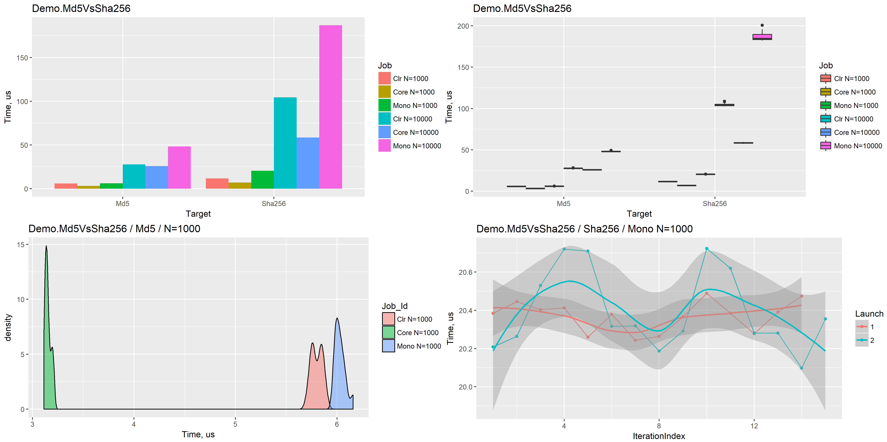

#Welcome to the BenchmarkDotNet documentation


[](https://www.nuget.org/packages/BenchmarkDotNet/) [](https://gitter.im/dotnet/BenchmarkDotNet) [](https://ci.appveyor.com/project/dotnetfoundation/benchmarkdotnet/branch/master) [](LICENSE.md) [](http://benchmarkdotnet.org/Overview.htm) [](https://github.com/dotnet/BenchmarkDotNet/wiki/ChangeLog)

**BenchmarkDotNet** is a powerful .NET library for benchmarking.

Source code is available at [@fa-github github.com/dotnet/BenchmarkDotNet](https://github.com/dotnet/BenchmarkDotNet)

Benchmarking is really hard (especially microbenchmarking), you can easily make a mistake during performance measurements.
BenchmarkDotNet will protect you from the common pitfalls (even for experienced developers) because it does all the dirty work for you:
  it generates an isolated project per each benchmark method,
  does several launches of this project,
  run multiple iterations of the method (include warm-up), and so on.
Usually, you even shouldn't care about a number of iterations because BenchmarkDotNet chooses it automatically to achieve the requested level of precision.

It's really easy to design a performance experiment with BenchmarkDotNet.
Just mark your method with the [Benchmark] attribute and the benchmark is ready.
Want to run your code on .NET Framework, .NET Core, and Mono?
No problem: a few more attributes and the corresponded projects will be generated; the results will be presented at the same summary table.
In fact, you can compare any environment that you want:
  you can check performance difference between processor architectures (x86/x64),
  JIT versions (LegacyJIT/RyuJIT),
  different sets of GC flags (like Server/Workstation),
  and so on.
You can also introduce one or several parameters and check the performance on different inputs at once.

BenchmarkDotNet helps you not only run benchmarks but also analyze the results: it generates reports in different formats and renders nice plots.
It calculates many statistics, allows you to run statistical tests, and compares results of different benchmark methods.
So it doesn't overload you with data, by default BenchmarkDotNet prints only the really important statistical values depending on your results:
  it allows you to keep summary small and simple for primitive cases but notify you about an additional important area for complicated cases
  (of course, you can request any numbers manually via additional attributes).

BenchmarkDotNet doesn't just blindly run your code: it tries to help you to conduct a qualitative performance investigation.

## Showtime

It's very easy to start using BenchmarkDotNet.
Let's look at an example:

```cs
[ClrJob(isBaseline: true), CoreJob, MonoJob]
[RPlotExporter, RankColumn]
public class Md5VsSha256
{
    private SHA256 sha256 = SHA256.Create();
    private MD5 md5 = MD5.Create();
    private byte[] data;

    [Params(1000, 10000)]
    public int N;

    [GlobalSetup]
    public void Setup()
    {
        data = new byte[N];
        new Random(42).NextBytes(data);
    }

    [Benchmark]
    public byte[] Sha256() => sha256.ComputeHash(data);

    [Benchmark]
    public byte[] Md5() => md5.ComputeHash(data);
}
```

BenchmarkDotNet allows designing a performance experiment in a user-friendly declarative way.
At the end of an experiment, it will generate a summary table which contains only important data in a compact and understandable form:

```
BenchmarkDotNet=v0.10.12, OS=Windows 10 Redstone 3 [1709, Fall Creators Update] (10.0.16299.192)
Intel Core i7-6700HQ CPU 2.60GHz (Skylake), 1 CPU, 8 logical cores and 4 physical cores
Frequency=2531249 Hz, Resolution=395.0619 ns, Timer=TSC
.NET Core SDK=2.0.3
  [Host] : .NET Core 2.0.3 (Framework 4.6.25815.02), 64bit RyuJIT
  Clr    : .NET Framework 4.7 (CLR 4.0.30319.42000), 64bit RyuJIT-v4.7.2600.0
  Core   : .NET Core 2.0.3 (Framework 4.6.25815.02), 64bit RyuJIT
  Mono   : Mono 5.4.0 (Visual Studio), 64bit

 Method | Runtime |     N |       Mean |     Error |    StdDev | Scaled | Rank |
------- |-------- |------ |-----------:|----------:|----------:|-------:|-----:|
    Md5 |     Clr |  1000 |   5.801 us | 0.0364 us | 0.0545 us |   1.00 |    2 |
    Md5 |    Core |  1000 |   3.151 us | 0.0197 us | 0.0289 us |   0.54 |    1 |
    Md5 |    Mono |  1000 |   6.030 us | 0.0354 us | 0.0507 us |   1.04 |    3 |
        |         |       |            |           |           |        |      |
    Md5 |     Clr | 10000 |  27.641 us | 0.1567 us | 0.2248 us |   1.00 |    2 |
    Md5 |    Core | 10000 |  25.754 us | 0.2220 us | 0.3323 us |   0.93 |    1 |
    Md5 |    Mono | 10000 |  48.149 us | 0.2993 us | 0.4480 us |   1.74 |    3 |
        |         |       |            |           |           |        |      |
 Sha256 |     Clr |  1000 |  11.663 us | 0.1059 us | 0.1553 us |   1.00 |    2 |
 Sha256 |    Core |  1000 |   6.922 us | 0.0444 us | 0.0651 us |   0.59 |    1 |
 Sha256 |    Mono |  1000 |  20.382 us | 0.1081 us | 0.1584 us |   1.75 |    3 |
        |         |       |            |           |           |        |      |
 Sha256 |     Clr | 10000 | 104.530 us | 1.1295 us | 1.6556 us |   1.00 |    2 |
 Sha256 |    Core | 10000 |  58.408 us | 0.4324 us | 0.6472 us |   0.56 |    1 |
 Sha256 |    Mono | 10000 | 186.900 us | 3.3683 us | 4.9371 us |   1.79 |    3 |
```

In artifacts, you can also find detailed information about each iteration.
You can export the data in different formats like (CSV, XML, JSON, and so on) or even generate beautiful plots:



## Main features

BenchmarkDotNet has a lot of awesome features for deep performance investigations:

* **Standard benchmarking routine:** generating an isolated project per each benchmark method; auto-selection of iteration amount; warmup; overhead evaluation; and so on
* **Execution control:** BenchmarkDotNet tries to choose the best possible way to evaluate performance, but you can also manually control amount of iterations, switch between cold start and warmed state, set the accuracy level, tune GC parameters, change environment variables, and more
* **Statistics:** by default, you will see the most important statistics like mean and standard deviation; but you can also manually ask for min/max values, confidence intervals, skewness, kurtosis, quartile, percentiles, or define own metrics
* **Comparing environments:** [Easy way](http://benchmarkdotnet.org/Configs/Jobs.htm) to compare different environments (x86 vs x64, LegacyJit vs RyuJit, Mono vs .NET Core, and so on)
* **Relative performance:** you can [easily]((http://benchmarkdotnet.org/Advanced/Baseline.htm)) evaluate difference between different methods of environments
* **Memory diagnostics:** the library not only measure performance of your code, but also prints information about memory traffic and amount of GC collections
* **Disassembly diagnostics:** you can ask for an assembly listing with the help of single additional attribute
* **Parametrization:** performance can be evaluated for different sets of input [parameters](http://benchmarkdotnet.org/Advanced/Params.htm) like in popular unit test frameworks
* **Environment information:** when your share performance results, it's very important to share information about your environment; BenchmarkDotNet automatically prints the exact version of your OS and processor; amount of physical CPU, physical cores, and logic cores; hypervisor (if you use it); frequency of the hardware timer; the JIT-compiler version; and more
* **Command-line support:** you can manage thousands of benchmark, group them by categories, [filter](http://benchmarkdotnet.org/Configs/Filters.htm) and run them from command line
* **Powerful reporting system:** it's possible to export benchmark results to markdown, csv, html, plain text, png plots

A few useful links for you:

* If you want to know more about BenchmarkDotNet features, check out the [Overview Page](http://benchmarkdotnet.org/Overview.htm).
* If you want to use BenchmarkDotNet for the first time, the [Getting Started](http://benchmarkdotnet.org/GettingStarted.htm) will help you.
* If you want to ask a quick question or discuss performance topics, use the [gitter](https://gitter.im/dotnet/BenchmarkDotNet) channel.

## Supported technologies

BenchmarkDotNet supports all kinds of .NET stacks:

* **Supported runtimes:** .NET Framework (4.6+), .NET Core (1.1+), Mono
* **Supported languages:** C#, F#, Visual Basic
* **Supported OS:** Windows, Linux, macOS

## Our users

The library is used by a large number of projects for performance discussions or as a part of the codebase:

* [CoreCLR](https://github.com/dotnet/coreclr/issues?utf8=✓&q=BenchmarkDotNet) (.NET Core runtime)
* [CoreFX](https://github.com/dotnet/corefx/issues?utf8=✓&q=BenchmarkDotNet) (.NET Core foundational libraries;
  see also [official benchmarking guide](https://github.com/dotnet/corefx/blob/master/Documentation/project-docs/benchmarking.md)),
* [Roslyn](https://github.com/dotnet/roslyn/search?q=BenchmarkDotNet&type=Issues&utf8=✓) (C# and Visual Basic compiler)
* [KestrelHttpServer](https://github.com/aspnet/KestrelHttpServer/tree/dev/benchmarks/Kestrel.Performance) (A cross platform web server for ASP.NET Core)
* [SignalR](https://github.com/aspnet/SignalR/tree/dev/benchmarks/Microsoft.AspNetCore.SignalR.Microbenchmarks)
* [EntityFrameworkCore](https://github.com/aspnet/EntityFrameworkCore/tree/dev/benchmarks)
* [F#](https://github.com/fsharp/fsharp/blob/master/tests/scripts/array-perf/array-perf.fs)
* [Orleans](https://github.com/dotnet/orleans/tree/master/test/Benchmarks)
* [Newtonsoft.Json](https://github.com/JamesNK/Newtonsoft.Json/tree/master/Src/Newtonsoft.Json.Tests/Benchmarks)
* [Elasticsearch.Net](https://www.elastic.co/guide/en/elasticsearch/client/net-api/current/bool-queries.html#_perfomance_considerations)
* [Dapper](https://github.com/StackExchange/Dapper/tree/master/Dapper.Tests.Performance)
* [Expecto](https://github.com/haf/expecto/tree/master/Expecto.BenchmarkDotNet)
* [Accord.NET Framework](https://github.com/accord-net/framework/tree/development/Tools/Performance)
* [ImageSharp](https://github.com/SixLabors/ImageSharp/tree/master/tests/ImageSharp.Benchmarks)
* [RavenDB](https://github.com/ravendb/ravendb/tree/v4.0/bench)
* [NodeTime](https://github.com/nodatime/nodatime/tree/master/src/NodaTime.Benchmarks)
* [Jint](https://github.com/sebastienros/jint/tree/dev/Jint.Benchmark)
* [NServiceBus](https://github.com/Particular/NServiceBus/issues?utf8=✓&q=+BenchmarkDotNet+)
* [Serilog](https://github.com/serilog/serilog/tree/dev/test/Serilog.PerformanceTests)
* [Autofac](https://github.com/autofac/Autofac/tree/develop/bench/Autofac.Benchmarks)
* [Npgsql](https://github.com/npgsql/npgsql/tree/dev/test/Npgsql.Benchmarks)

It's not the full list.
On GitHub, you can find hundreds of
  [issues](https://github.com/search?o=desc&q=BenchmarkDotNet+-repo:dotnet%2FBenchmarkDotNet&s=created&type=Issues&utf8=✓) and
  [commits](https://github.com/search?o=desc&q=BenchmarkDotNet+-repo:dotnet%2FBenchmarkDotNet&s=committer-date&type=Commits&utf8=✓)
  which involve BenchmarkDotNet.
There are [tens of thousands of files](https://github.com/search?o=desc&q=BenchmarkDotNet+-repo:dotnet%2FBenchmarkDotNet&s=indexed&type=Code&utf8=✓)
  which contain "BenchmarkDotNet".

## Contributions are welcome!

BenchmarkDotNet is already a stable full-featured library which allows performing performance investigation on a professional level.
And it continues to evolve!
We add new features all the time, but we have too many new cool ideas.
Any help will be appreciated.
You can develop new features, fix bugs, improve the documentation, or do some other cool stuff.

If you want to contribute, check out the
  [Contributing guide](http://benchmarkdotnet.org/Contributing.htm) and
  [up-for-grabs](https://github.com/dotnet/BenchmarkDotNet/issues?q=is:open+is:issue+label:up-for-grabs) issues.
If you have new ideas or want to complain about bugs, feel free to [create a new issue](https://github.com/dotnet/BenchmarkDotNet/issues/new).
Let's build the best tool for benchmarking together!

## Code of Conduct

This project has adopted the code of conduct defined by the [Contributor Covenant](http://contributor-covenant.org/)
to clarify expected behavior in our community.
For more information see the [.NET Foundation Code of Conduct](https://dotnetfoundation.org/code-of-conduct).

## .NET Foundation

This project is supported by the [.NET Foundation](https://dotnetfoundation.org).